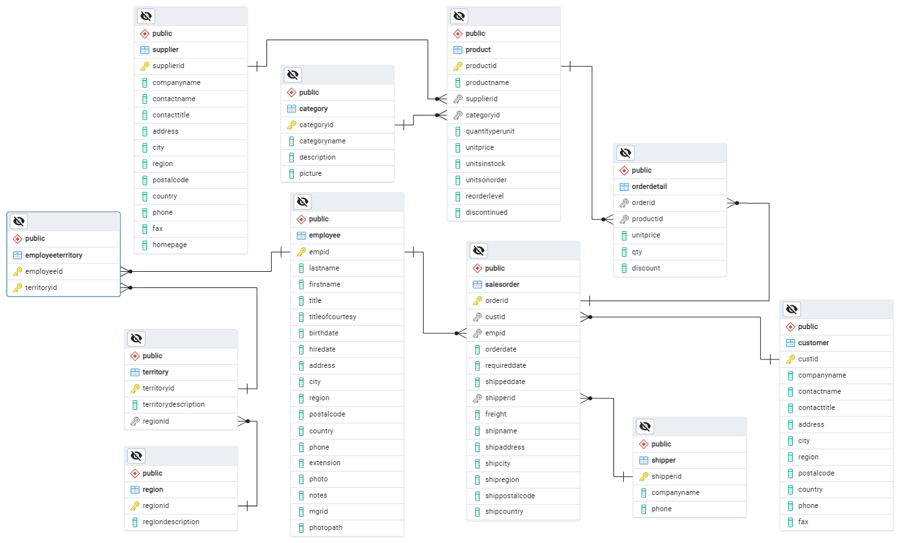

# Northwind and Pubs Sample Databases
## Source: [Open source projects and samples from Microsoft](https://github.com/Microsoft/sql-server-samples/tree/master/samples/databases/northwind-pubs)
## Introduction
This analysis presents the sales data on various products, years, and shipping methods.
The original source is for Microsoft SQL Server, but I used Postgres.
## Entity Relationship Diagram (ERD)

## Data Analysis
1. Statistics
```
,SUM(revenue) AS monthly_revenue
	   ,ROUND(AVG(revenue),2) AS avg_monthly_revenue
```
2. Views
```
CREATE OR REPLACE VIEW employee_details AS
SELECT empid
		,CONCAT(titleofcourtesy,' ',lastname,' ',firstname) AS "Name"
```
3. Partition
```
WITH prod_rank AS 
(SELECT *
	,RANK()OVER(PARTITION BY categoryname ORDER BY gross_revenue)
```
4. Joins
```
FROM orderdetail ord
JOIN salesorder sal
					ON ord.orderid = sal.orderid
```
5. Filtering and Aggregation
```
 ,SUM(revenue) AS gross_revenue 
FROM prod_level
GROUP BY ROLLUP (categoryname
	   			,productname)
```
### Why I Picked This Dataset
Northwind has a wide variety of tables, which I needed to use to explore my skills in joining and analyzing data from different tables.
